# Simplified Payment Service

API RESTful para simular uma plataforma simplificada de pagamentos.

A aplicação permite cadastrar usuários, manter saldo em carteira e realizar transferências entre usuários comuns e lojistas, seguindo regras de negócio de validação de saldo, autorização externa e notificação de pagamento.

---

## Objetivo

Este projeto implementa um fluxo simplificado de transferência de dinheiro entre usuários.

A regra principal é:

```text
Usuários comuns podem enviar e receber dinheiro.
Lojistas apenas recebem dinheiro.
Toda transferência precisa validar saldo, consultar autorizador externo e registrar a operação de forma transacional.
```

---

## Stack técnica

- Kotlin
- Java 21
- Spring Boot 4
- Gradle Kotlin DSL
- Spring Web MVC
- Spring Data JPA
- Bean Validation
- Flyway
- MySQL
- Spring Boot Actuator
- Springdoc OpenAPI / Swagger
- Docker Compose
- JUnit 5
- MockK
- AssertJ
- JaCoCo
- ktlint

---

## Arquitetura

Este projeto segue **Arquitetura Hexagonal / Ports and Adapters**.

Regra principal:

```text
O domínio não deve depender de Spring, banco de dados, HTTP, clients externos ou qualquer detalhe de infraestrutura.
```

Estrutura esperada:

```text
src/main/kotlin/com/simplifiedpayment/
├── SimplifiedPaymentServiceApplication.kt
├── core/
│   ├── common/
│   │   └── messages/
│   ├── domain/
│   │   ├── model/
│   │   ├── exception/
│   │   └── valueobject/
│   ├── port/
│   │   ├── input/
│   │   └── output/
│   └── usecase/
└── app/
    ├── adapter/
    │   ├── input/
    │   │   └── web/
    │   │       ├── controllers/
    │   │       ├── handler/
    │   │       ├── mappers/
    │   │       ├── requests/
    │   │       ├── responses/
    │   │       └── swagger/
    │   └── output/
    │       ├── client/
    │       └── persistence/
    │           ├── entity/
    │           ├── mapper/
    │           └── repository/
    └── configuration/
```

---

## Regras de negócio

- Usuários possuem nome completo, documento, e-mail, senha e carteira.
- Documento e e-mail devem ser únicos.
- Usuários comuns podem enviar dinheiro.
- Usuários comuns podem receber dinheiro.
- Lojistas podem receber dinheiro.
- Lojistas não podem enviar dinheiro.
- O pagador precisa ter saldo suficiente.
- Antes de concluir a transferência, a aplicação consulta um autorizador externo.
- A transferência deve ser transacional.
- Em caso de falha, o saldo deve ser preservado.
- Após uma transferência aprovada, o recebedor deve ser notificado.
- Falha na notificação não deve desfazer uma transferência já concluída.

---

## Domínio

### User

Representa um usuário da plataforma.

Campos principais:

```text
userId
fullName
document
email
password
type
createdAt
updatedAt
```

---

### Wallet

Representa a carteira de um usuário.

Campos principais:

```text
walletId
userId
balance
createdAt
updatedAt
```

---

### Transfer

Representa uma transferência entre dois usuários.

Campos principais:

```text
transferId
payerId
payeeId
value
status
createdAt
updatedAt
```

---

### UserType

Tipos possíveis:

```text
COMMON
MERCHANT
```

---

### TransferStatus

Status possíveis:

```text
CREATED
AUTHORIZED
COMPLETED
FAILED
```

---

## Integrações externas

### Serviço autorizador

Antes de concluir a transferência, a aplicação consulta um serviço externo de autorização.

```http
GET https://util.devi.tools/api/v2/authorize
```

Se a autorização for negada ou o serviço estiver indisponível, a transferência não deve ser concluída.

---

### Serviço de notificação

Após uma transferência concluída, a aplicação tenta notificar o recebedor.

```http
POST https://util.devi.tools/api/v1/notify
```

A notificação pode falhar sem desfazer a transferência, desde que o pagamento já tenha sido concluído.

---

## API

A API principal de transferência segue o contrato:

```http
POST /transfer
Content-Type: application/json
```

Payload:

```json
{
  "value": 100.0,
  "payer": 4,
  "payee": 15
}
```

Resposta esperada em caso de sucesso:

```json
{
  "transferId": "4e0f7d25-8f79-44ab-9f7e-6c4f91b41f2a",
  "payer": 4,
  "payee": 15,
  "value": 100.0,
  "status": "COMPLETED"
}
```

---

## Swagger

A documentação completa da API estará disponível via Swagger.

Swagger UI:

```text
http://localhost:8080/swagger-ui.html
```

OpenAPI JSON:

```text
http://localhost:8080/v3/api-docs
```

---

## Actuator

A aplicação expõe endpoints operacionais.

Health:

```http
GET /actuator/health
```

Metrics:

```http
GET /actuator/metrics
```

Prometheus:

```http
GET /actuator/prometheus
```

---

# Como rodar localmente

## 1. Clonar o repositório

```bash
git clone https://github.com/diogobackend/simplified-payment-service.git
cd simplified-payment-service
```

---

## 2. Subir o MySQL

```bash
docker compose up -d
```

Verificar container:

```bash
docker ps
```

Container esperado:

```text
simplified-payment-mysql
```

---

## 3. Rodar a aplicação

```bash
./gradlew bootRun
```

A aplicação deve subir em:

```text
http://localhost:8080
```

---

## 4. Validar health check

```bash
curl http://localhost:8080/actuator/health
```

Resposta esperada:

```json
{
  "status": "UP"
}
```

---

## 5. Validar Swagger

Acessar no navegador:

```text
http://localhost:8080/swagger-ui.html
```

---

## 6. Acessar o banco local

```bash
docker exec -it simplified-payment-mysql mysql -u payment_user -ppayment_pass payment_db
```

Dentro do MySQL:

```sql
SHOW TABLES;
```

---

# Comandos mais usados

## Subir infraestrutura local

```bash
docker compose up -d
```

---

## Parar infraestrutura local

```bash
docker compose down
```

---

## Parar e remover volumes

```bash
docker compose down -v
```

---

## Ver logs dos containers

```bash
docker compose logs -f
```

---

## Ver logs do MySQL

```bash
docker compose logs -f mysql
```

---

## Rodar aplicação

```bash
./gradlew bootRun
```

---

## Rodar build completo

```bash
./gradlew clean build
```

---

## Rodar testes

```bash
./gradlew test
```

---

## Rodar testes com relatório JaCoCo

```bash
./gradlew clean test jacocoTestReport
```

---

## Abrir relatório JaCoCo

```bash
xdg-open build/reports/jacoco/test/html/index.html
```

---

## Rodar ktlint check

```bash
./gradlew ktlintCheck
```

---

## Corrigir formatação com ktlint

```bash
./gradlew ktlintFormat
```

---

## Rodar validação geral antes de commit

```bash
./gradlew ktlintFormat
./gradlew ktlintCheck
./gradlew clean test jacocoTestReport
./gradlew clean build
```

---

## Limpar build local

```bash
./gradlew clean
```

---

## Ver dependências do projeto

```bash
./gradlew dependencies
```

---

Principais cenários de teste:

- transferência com sucesso;
- pagador inexistente;
- recebedor inexistente;
- lojista tentando enviar dinheiro;
- saldo insuficiente;
- autorização externa negada;
- falha no autorizador externo;
- transferência transacional;
- notificação com sucesso;
- falha na notificação sem rollback do pagamento.

---

# Tratamento de erros

A API deve retornar erros padronizados.

Exemplo:

```json
{
  "status": 400,
  "error": "Bad Request",
  "message": "Payer does not have enough balance",
  "path": "/transfer"
}
```

Erros previstos:

```text
400 Bad Request
404 Not Found
409 Conflict
422 Unprocessable Entity
500 Internal Server Error
```

---


## Transação no fluxo de transferência

A transferência precisa ser atômica:

```text
ou todo o débito/crédito é concluído, ou nada é persistido.
```

## Notificação fora da regra crítica

A notificação acontece após a transferência concluída.

Falha na notificação não deve desfazer a transferência.

---

# Fluxo de transferência

```text
Recebe requisição POST /transfer
      |
      v
Valida payload
      |
      v
Busca pagador
      |
      v
Busca recebedor
      |
      v
Valida se pagador não é lojista
      |
      v
Valida saldo do pagador
      |
      v
Consulta autorizador externo
      |
      v
Debita saldo do pagador
      |
      v
Credita saldo do recebedor
      |
      v
Registra transferência
      |
      v
Confirma transação
      |
      v
Envia notificação ao recebedor
```
---

## Cenários de Teste via Swagger

Esta seção descreve os principais cenários de teste da API de transferência.

Endpoint utilizado:

```http
POST /transfer
```

Swagger:

```text
http://localhost:8080/swagger-ui.html
```

### Massa de dados local

A aplicação possui uma massa local criada por migration para facilitar os testes manuais.

Resumo da massa:

| Tipo | Quantidade |
|---|---:|
| Usuários comuns com carteira | 17 |
| Lojistas com carteira | 13 |
| Usuários comuns sem carteira | 8 |
| Lojistas sem carteira | 8 |
| Carteiras de usuários comuns | 17 |
| Carteiras de lojistas | 13 |

> Usuário do tipo `COMMON` pode enviar dinheiro.  
> Usuário do tipo `MERCHANT` não pode enviar dinheiro, apenas receber.

---

## Cenários de sucesso

### Cenário 1 — Usuário comum(CPF) paga um lojista(CNPJ)

**Objetivo:** validar uma transferência comum para lojista.

**Payload:**

```json
{
  "value": 100,
  "payer": 1,
  "payee": 101
}
```

**Resultado esperado:**

```text
HTTP 201 Created
status: COMPLETED
```

**Efeito esperado no banco:**

| Usuário | Saldo antes | Saldo depois |
|---|---:|---:|
| Ana Silva | 1000.00 | 900.00 |
| Padaria São João | 0.00 | 100.00 |


**Evidência da Requisição**


**Evidência Banco**

***Evidência da transferência no banco***
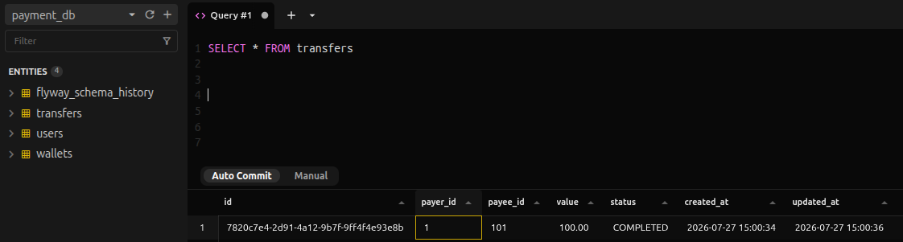

***Valores antes da transferência***

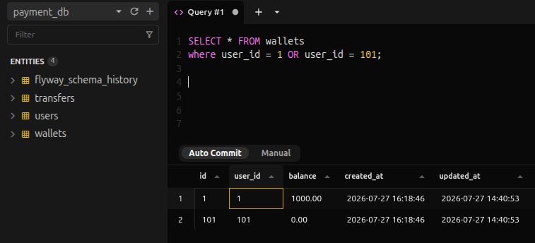

***Valores após a transferência***


---

### Cenário 2 — Usuário comum paga outro usuário comum, ambos CPF

**Objetivo** validar uma transferência entre dois usuários comuns.

**Payload**

```json
{
  "value": 50,
  "payer": 2,
  "payee": 3
}
```

**Resultado esperado:**

```text
HTTP 201 Created
status: COMPLETED
```

**Efeito esperado no banco:**

| Usuário | Saldo antes | Saldo depois |
|---|---:|---:|
| Bruno Costa | 500.00 | 450.00 |
| Carla Mendes | 100.00 | 150.00 |

**Evidência da Requisição**

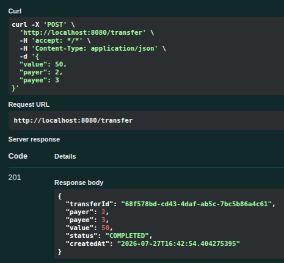

**Evidência Banco**

***Evidência da transferência no banco***
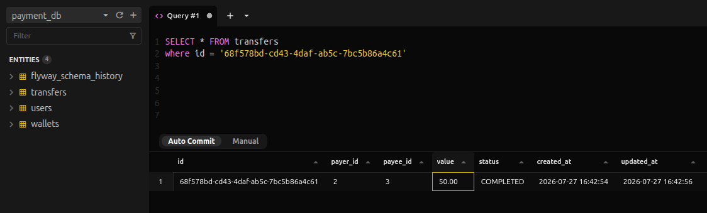

***Valores antes da transferência***
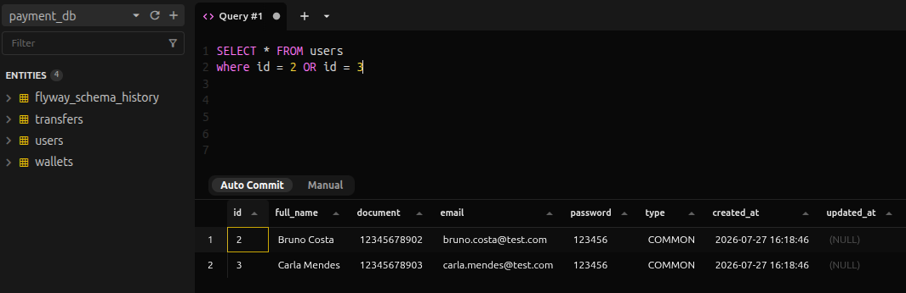
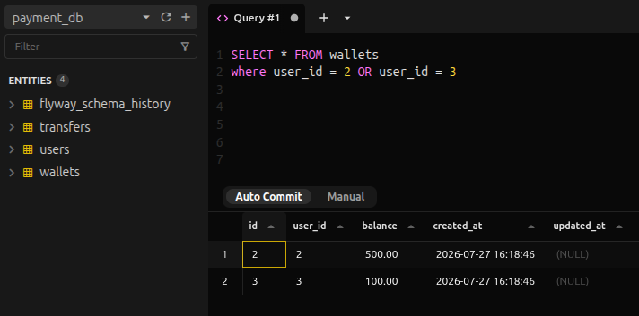

***Valores após a transferência***
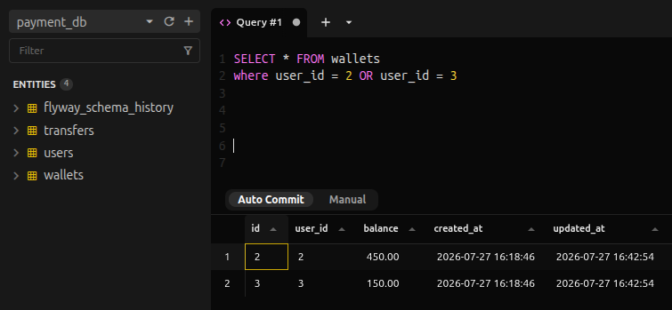

---

### Cenário 3 — Transferência com centavos

**Objetivo:** validar transferência com valor decimal.

**Payload:**

```json
{
  "value": 25.50,
  "payer": 7,
  "payee": 102
}
```

**Resultado esperado:**

```text
HTTP 201 Created
status: COMPLETED
```

**Efeito esperado no banco:**

| Usuário | Saldo antes | Saldo depois |
|---|---:|---:|
| Helena Martins | 75.50 | 50.00 |
| Farmácia Central | 250.00 | 275.50 |

**Evidência da Requisição**


**Evidência Banco**

***Evidência da transferência no banco***


***Valores antes da transferência***


***Valores após a transferência***


---

## Cenários de erro

### Cenário 4 — Lojista(CNPJ) tentando enviar dinheiro para pessoa comun(CPF)

**Objetivo:** validar que lojista não pode ser pagador.

**Payload:**

```json
{
  "value": 100,
  "payer": 101,
  "payee": 1
}
```

**Resultado esperado:**

```text
HTTP 422 Unprocessable Content
message: Merchant cannot send money
```
**Evidência Banco**


**Evidência da Requisição**

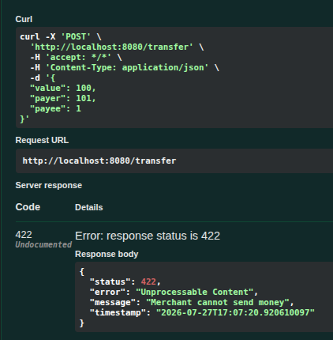

---

### Cenário 5 — Saldo insuficiente

**Objetivo:** validar que a transferência não é permitida quando o pagador não possui saldo suficiente.

**Payload:**

```json
{
  "value": 999999,
  "payer": 1,
  "payee": 101
}
```

**Resultado esperado:**

```text
HTTP 400 Bad Request
message: Wallet balance is insufficient
```
**Evidência Banco**
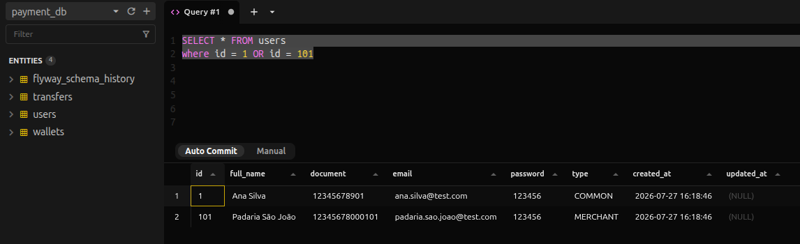


**Evidência da Requisição**


---

### Cenário 6 — Usuário com saldo zero tentando pagar

**Objetivo:** validar que usuário com saldo zero não consegue realizar transferência.

**Payload:**

```json
{
  "value": 1,
  "payer": 5,
  "payee": 101
}
```

**Resultado esperado:**

```text
HTTP 400 Bad Request
message: Wallet balance is insufficient
```
**Evidência Banco**
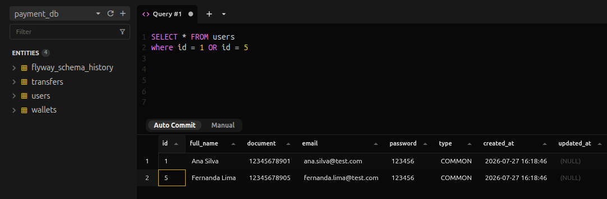


**Evidência da Requisição**


---

### Cenário 7 — Pagador inexistente

**Objetivo:** validar erro quando o pagador não existe na base.

**Payload:**

```json
{
  "value": 100,
  "payer": 999,
  "payee": 101
}
```

**Resultado esperado:**

```text
HTTP 404 Not Found
message: User not found with id: 999
```
**Evidência Banco**


**Evidência da Requisição**


---

### Cenário 8 — Recebedor inexistente

**Objetivo:** validar erro quando o recebedor não existe na base.

**Payload:**

```json
{
  "value": 100,
  "payer": 1,
  "payee": 999
}
```

**Resultado esperado:**

```text
HTTP 404 Not Found
message: User not found with id: 999
```
**Evidência Banco**


**Evidência da Requisição**


---

### Cenário 9 — Pagador sem carteira

**Objetivo:** validar erro quando o pagador existe, mas não possui carteira.

**Payload:**

```json
{
  "value": 100,
  "payer": 201,
  "payee": 101
}
```

**Resultado esperado:**

```text
HTTP 404 Not Found
message: Wallet not found with userId: 201
```
**Evidência Banco**
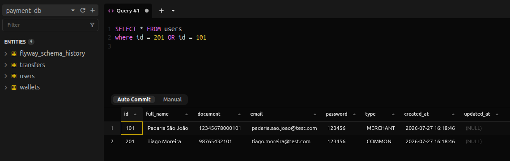


**Evidência da Requisição**


---

### Cenário 10 — Recebedor comum(CPF) sem carteira

**Objetivo:** validar erro quando o recebedor comum existe, mas não possui carteira.

**Payload:**

```json
{
  "value": 100,
  "payer": 1,
  "payee": 201
}
```

**Resultado esperado:**

```text
HTTP 404 Not Found
message: Wallet not found with userId: 201
```
**Evidência Banco**
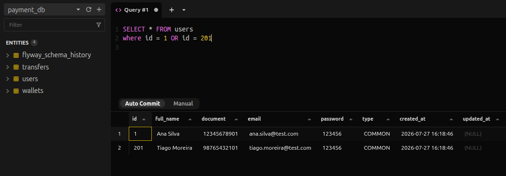
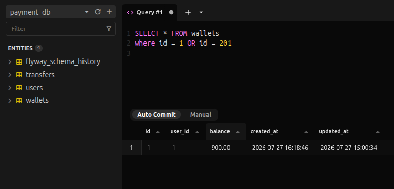


**Evidência da Requisição**

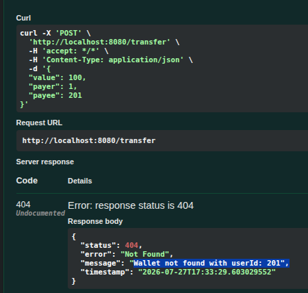
---

### Cenário 11 — Recebedor lojista(CNPJ) sem carteira

**Objetivo:** validar erro quando o lojista existe, mas não possui carteira.

**Payload:**

```json
{
  "value": 100,
  "payer": 1,
  "payee": 301
}
```

**Resultado esperado:**

```text
HTTP 404 Not Found
message: Wallet not found with userId: 301
```
**Evidência Banco**
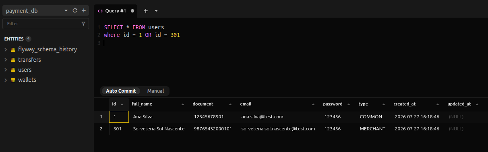


**Evidência da Requisição**


---

### Cenário 12 — Pagador e recebedor são o mesmo usuário

**Objetivo:** validar que uma pessoa não pode transferir dinheiro para ela mesma.

**Payload:**

```json
{
  "value": 100,
  "payer": 1,
  "payee": 1
}
```

**Resultado esperado:**

```text
HTTP 400 Bad Request
message: Transfer payer and payee must be different
```
**Evidência Banco**


**Evidência da Requisição**

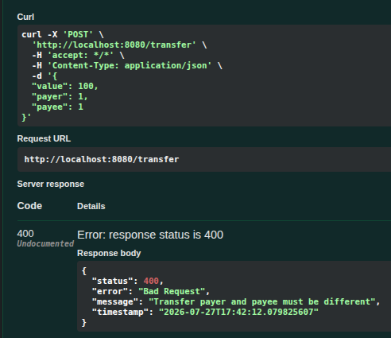
---

### Cenário 13 — Valor zerado

**Objetivo:** validar erro de entrada quando o valor da transferência é zero.

**Payload:**

```json
{
  "value": 0,
  "payer": 1,
  "payee": 101
}
```

**Resultado esperado:**

```text
HTTP 400 Bad Request
message contendo: value
```

**Evidência da Requisição**

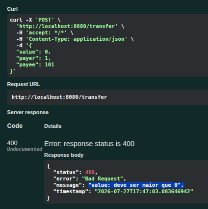

---

### Cenário 14 — Valor negativo

**Objetivo:** validar erro de entrada quando o valor da transferência é negativo.

**Payload:**

```json
{
  "value": -10,
  "payer": 1,
  "payee": 101
}
```

**Resultado esperado:**

```text
HTTP 400 Bad Request
message contendo: value
```
**Evidência da Requisição**


---

### Cenário 15 — Pagador inválido

**Objetivo:** validar erro de entrada quando o identificador do pagador é inválido.

**Payload:**

```json
{
  "value": 100,
  "payer": 0,
  "payee": 101
}
```

**Resultado esperado:**

```text
HTTP 400 Bad Request
message contendo: payer
```
**Evidência da Requisição**

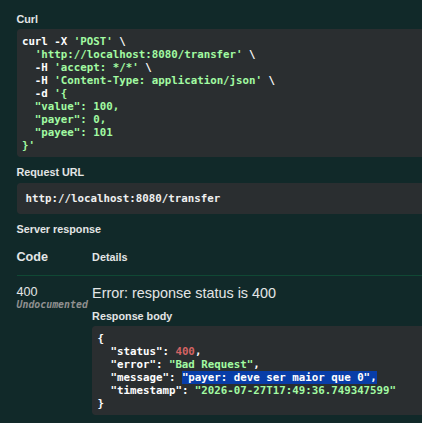
---

### Cenário 16 — Recebedor inválido

**Objetivo:** validar erro de entrada quando o identificador do recebedor é inválido.

**Payload:**

```json
{
  "value": 100,
  "payer": 1,
  "payee": 0
}
```

**Resultado esperado:**

```text
HTTP 400 Bad Request
message contendo: payee
```
**Evidência da Requisição**


---

## Observação sobre autorização externa

A API utiliza um serviço externo para autorização da transferência.

Caso um cenário de sucesso retorne:

```text
HTTP 403 Forbidden
message: Transfer was not authorized
```

isso significa que o autorizador externo negou ou não respondeu corretamente.

Nesse caso, a transferência não será concluída e os saldos não serão alterados.